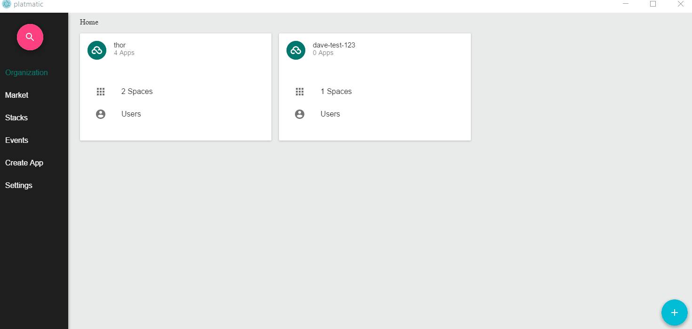

# Platmatic

[](https://travis-ci.org/el-davo/platmatic)
[](https://ci.appveyor.com/project/el-davo/platmatic/branch/master)

A desktop application written in electron and react for interacting with cloud foundry



## Download

You can download the latest installers from the releases section

https://github.com/el-davo/platmatic/releases

## Features

* Search functionality (Search for apps or third party services)
* SSH into containers with one click
* Lists system wide events (I.e. app crashes)
* Tail app logs with one click
* Auto login and token refresh
* Works on MAC/Windows/Linux
* Live graphs of memory and CPU usage
* Able to create apps on cloud foundry through this tool
* Market

## Development

### Install

``
yarn
``

### Run in dev mode

```
npm run dev
```

### Tests

```
npm run test-watch
```

```
npm run lint
```

### Building

#### Windows

```
npm run package:win
```

#### MAC

This requires building on a mac

```
npm run package:mac
```
